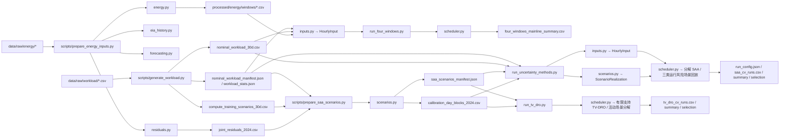

# 项目文件导航与分工

## 端到端数据流

### 流程如何由代码实现

| 阶段 | 入口与核心调用 | 输入 | 输出 |
| --- | --- | --- | --- |
| 1. workload 审计 | `audit_workload_days.py`、`analyze_workload.py` | Alibaba 原始 trace | 日级审计与容量统计 |
| 2. workload 构造 | `generate_workload.py::aggregate_trace` → `generate_nominal_scenario` / `generate_scenarios` | `batch_task.csv` 与固定随机种子 | 30 天名义负荷、训练场景、累计释放/截止包络、manifest |
| 3. 能源历史读取 | `prepare_energy_inputs.py` → `eia_history.load_erco_history` / `load_houston_dam_prices` | EIA-930、ERCOT DAM | 对齐的历史风光、碳强度和价格 |
| 4. 无泄漏预测 | `forecasting.select_ridge_alpha` → `forecast_delivery_dates` | 历史能源序列 | 日前预测及 2023 参数选择证据 |
| 5. 能源窗口与残差 | `energy.write_study_inputs`；`residuals.write_joint_residuals` | 预测、实际值、价格 | 论文窗口 CSV、2024 联合残差和季节折 |
| 6. SAA 场景登记 | `prepare_saa_scenarios.py` → `scenarios.write_calibration_day_blocks` / `write_saa_scenario_manifest` | 联合残差、DAM、workload 场景 | 校准日块表与可重建 manifest |
| 7. 模型输入 | `inputs.build_hourly_input` 或 `build_hourly_input_from_rows` | 能源窗口、名义 workload、容量统计 | 每小时 `HourlyInput` |
| 8. 场景重建 | `scenarios.load_saa_scenarios` | manifest、校准表、workload 源日 | 联合 `ScenarioRealization` 序列 |
| 9. 确定性实验 | `run_four_windows.py` → `scheduler.solve_wind_solar_storage` → `replay_actual_wind_solar` | `HourlyInput` | 确定性日前计划与实际回放结果 |
| 10. SAA 实验 | `run_uncertainty_methods.py` → `solve_decomposed_saa_wind_solar_storage` | `HourlyInput` + 联合场景 | 活动场景主问题、全场景回放与三类运行风险 |
| 11. SAA 校准选择 | `summarize_saa_runs` → `select_saa_sample_size` | 每窗口结果 CSV | 每个N完成36窗口后按 `model.md §3.4.1` 计算三通道Wilson上界；首个达标N写入选择JSON并停止 |
| 12. 静态 Γ-RO | `run_gamma_ro.py` → `load_hourly_downward_residual_quantiles` → `solve_static_gamma_ro_wind_solar_storage` | 训练折风光下偏分位 + N=20 完整算力包络 | Γ 支持函数鲁棒日前计划、共同验证回放、断点 CSV |
| 13. Γ 自适应选择 | `run_gamma_ro.summarize_runs` | 每个 Γ 的 36 窗口结果 | 三类 Wilson 上界；达标即停，不可行前区间再细化 |
| 14. 有限支持 TV-DRO | `run_tv_dro.py` → `solve_finite_support_tv_dro_wind_solar_storage` | N=20完整联合支持、β=0.10、ρ候选 | 以 `floor(N(β-ρ))` 精确收紧三通道训练违反数，断点运行36窗口 |
| 15. TV 半径选择 | `summarize_tv_dro_runs` → `select_tv_radius` | 每个ρ的36窗口结果 | 首个三通道Wilson上界均不超过0.10的正半径写入选择JSON并停止 |

定位问题时从结果文件的 `run_config.json` 和 manifest 哈希反向追踪：结果目录 → 运行脚本 → `inputs.py`/`scenarios.py` → processed 数据 → 对应准备脚本 → raw 数据。不要直接手工修改中间 CSV 来修正模型结果。

## 核心代码

| 文件 | 用途 |
| --- | --- |
| `../alibaba2018_dro/config.py` | 公共实验参数、资源容量和时间窗口常量；碳预算常量仅供历史诊断复现 |
| `../alibaba2018_dro/eia_history.py` | 读取 EIA-930 与 ERCOT DAM 历史数据 |
| `../alibaba2018_dro/forecasting.py` | 带 48 小时保护的能源预测模型 |
| `../alibaba2018_dro/energy.py` | 构造年度能源表与论文窗口输入 |
| `../alibaba2018_dro/inputs.py` | 把能源、容量和 workload 包络对齐为小时模型输入 |
| `../alibaba2018_dro/residuals.py` | 生成风、光、碳联合残差日块与季节折 |
| `../alibaba2018_dro/scenarios.py` | 读取 manifest，重建 SAA/RO 场景并计算训练折小时位置风光下偏分位 |
| `../alibaba2018_dro/scheduler.py` | 统一使用 Gurobi 的确定性、SAA、静态 Γ-RO、有限支持 TV-DRO、三类运行风险追索与实际回放；碳排放事后核算 |

更详细的数据流见 `../alibaba2018_dro/README.md`。`scheduler.py` 的日前与追索模型统一使用 Gurobi；碳排放 LP 对偶割仅在历史诊断模式下另外使用 SciPy/HiGHS。

## 执行脚本

| 文件 | 用途 |
| --- | --- |
| `../scripts/analyze_workload.py` | 审计原始 workload 并统计容量、工作量和时间特征 |
| `../scripts/audit_workload_days.py` | 检查逐日 workload 数据完整性与异常 |
| `../scripts/generate_workload.py` | 生成名义 workload、场景池和累计柔性包络 |
| `../scripts/plot_aggregate_workload.py` | 绘制聚合 workload |
| `../scripts/plot_resampled_workload.py` | 绘制重采样 workload 场景 |
| `../scripts/prepare_energy_inputs.py` | 生成无泄漏预测、能源窗口和输入清单 |
| `../scripts/prepare_saa_scenarios.py` | 生成 2024 校准日块表与 SAA manifest |
| `../scripts/run_four_windows.py` | 运行确定性四窗口基线 |
| `../scripts/run_uncertainty_methods.py` | 按 N 自适应运行 SAA 三折分解、验证、Wilson 汇总与最小达标样本量选择 |
| `../scripts/run_gamma_ro.py` | 按 Γ 从松到紧运行静态 RO 三折、共同回放、Wilson 汇总、断点恢复与选择 |
| `../scripts/run_tv_dro.py` | 按ρ从小到大运行有限支持TV-DRO三折、共同回放、Wilson汇总、断点恢复与选择 |
| `../scripts/run_2025_deterministic_workload_replay.py` | 首个统一比较基线：四个2025能源窗口分别配对100条算力轨迹，按窗口断点输出条件回放结果 |

## 验证代码

| 文件 | 主要检查 |
| --- | --- |
| `../tests/test_energy_inputs.py` | 数据时间切分、预测保护、窗口和价格输入 |
| `../tests/test_energy_residuals.py` | 联合残差、季节折和缺失日处理 |
| `../tests/test_mainline_scheduler.py` | Gurobi 优化约束、BESS、SAA 追索、四级词典序、Γ 支持函数与边界和碳对偶割 |
| `../tests/test_scenarios.py` | 校准表与 manifest 可重建性 |
| `../tests/test_uncertainty_calibration.py` | Wilson 门槛、汇总和样本选择规则 |
| `../tests/test_workload_scenarios.py` | 工作量守恒、柔性包络和名义场景平衡 |

## 数据与结果目录

| 路径 | 用途 |
| --- | --- |
| `../data/raw/` | 原始来源数据；不手工改写 |
| `../data/processed/` | 由准备脚本生成的清洗数据、场景和 manifest |
| `../data/results/` | 实验结果、运行配置和预检证据 |
| `../data/results/calibration/` | 不确定性方法校准与各阶段预检；不同配置使用独立子目录 |

## 文档索引

文档按用途分为两类，分别放在 `research/` 和 `reproduction/`。本文件保留在 `docs/` 根目录作为唯一总导航。

### A. 研究论证类

面向论文写作、模型解释和结果讨论，正文只保留稳定定义与可引用结论。

| 文档 | 职责 |
| --- | --- |
| `../README.md` | 研究问题、当前边界与总进度 |
| [`research/model.md`](research/model.md) | 成本目标、联合不确定性和追索词典序的正式数学定义 |
| [`research/uncertainty_explained.md`](research/uncertainty_explained.md) | 不确定性如何进入约束并影响成本的学习型解释 |
| [`research/compute_envelope.md`](research/compute_envelope.md) | 算力包络、有效容量、聚合边界及完整推导 |
| [`research/forecasting.md`](research/forecasting.md) | 无泄漏预测、联合残差与实际回放口径 |
| [`research/data_feasibility.md`](research/data_feasibility.md) | 数据能支持和不能支持的论文主张 |
| [`research/current_results.md`](research/current_results.md) | 当前主线结果、口径修正与可用结论边界 |
| [`research/paper_tables_figures.md`](research/paper_tables_figures.md) | 正式统一比较需要的论文图表和报告字段 |
| [`research/results.md`](research/results.md) | 旧 PV+BESS 开发原型档案，仅作回归对照 |

### B. 实现复现类

面向代码执行、数据追踪和维护，记录入口、参数、哈希、变更与历史证据。

| 文档或导航 | 职责 |
| --- | --- |
| [`reproduction/design.md`](reproduction/design.md) | 实现边界、模块接口、实验顺序和完成门槛 |
| [`reproduction/implementation_log.md`](reproduction/implementation_log.md) | 每次实现、命令、失败原因、修正和验证证据 |
| `../alibaba2018_dro/README.md` | 代码模块职责和调用关系 |
| `../data/README.md` | raw / processed / results 三层数据边界 |
| `../data/raw/energy/README.md` | 能源原始数据来源与哈希 |
| `../data/raw/workload/README.md` | Alibaba v2018 原始字段和下载说明 |
| `../data/processed/energy/README.md` | 能源派生数据与窗口文件 |
| `../data/processed/workload/README.md` | 算力派生数据、包络与场景 |
| `../data/results/README.md` | 结果目录、历史/当前口径和复现命令 |

分工原则：

- `../README.md` = “做什么、为什么、研究边界和当前状态”；
- `reproduction/design.md` = “目标如何实现、当前差距和实施顺序”；
- `research/model.md` = “目标数学模型与不确定性定义”；
- `research/compute_envelope.md` = “算力包络和容量如何从数据推导并由代码实现”；
- `research/uncertainty_explained.md` = “不确定性作用在哪里，以及为什么会改变成本”；
- `reproduction/implementation_log.md` = “每次实际改了什么、如何验证、失败后如何改进”；
- `research/results.md` = “旧原型跑了什么，仅可作回归对照”。

当前确定性主线的机器可读结果保存在 `../data/results/four_windows_mainline_summary.csv`；联合不确定性方法完成同口径比较后，再将正式论文结果写入 `research/results.md`。公式只放 `research/model.md`。

文件管理规则：

1. 优先修改职责相符的现有文件，不为单次实验复制模型或说明文档。
2. 每次实现必须更新 `reproduction/implementation_log.md`；数学定义稳定后才更新 `research/model.md`，阶段能力变化时更新 `reproduction/design.md`。
3. 生成数据放入 `data/processed/`，实验输出放入 `data/results/`；每种预检配置使用独立结果目录，不覆盖历史证据。
4. 正式实验结果至少保留运行配置、随机种子或 manifest、输入哈希和结果表；失败预检必须标明不可用于论文结论。
5. 同一事实只在一处详细维护，其它文件用链接和一句摘要导航。
