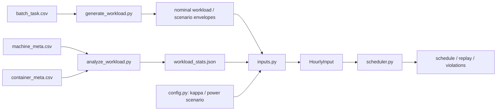

# 算力包络、有效容量与代码实现

本文档集中维护算力侧从 Alibaba v2018 记录到优化约束的完整推导，以及数据证据、反事实参数、单位转换和代码数据流。主模型只保留核心约束并引用本文；实现路线与数据可行性分别见 [design.md](design.md) 和 [data_feasibility.md](data_feasibility.md)。

## 1. 结论与口径边界

当前算力模型由三个层次组成：

1. `batch_task` 提供任务工作量和观测执行开始时序的代理，由此构造批处理释放轨迹及其累计可执行/必须完成包络；
2. `machine_meta` 给出物理核数，`container_meta` 给出在线静态预留代理，再以有效容量比例和统一缩放建立尺度闭合；
3. 在线业务被视为固定、不可削减负载，批处理是调度变量，因此共享容量约束代入在线负载后，在代码中表现为批处理的剩余容量上限。

有效容量和柔性窗口都不是 Alibaba 轨迹直接给出的生产参数：

| 数量 | 当前来源 | 可以解释为 | 不能解释为 |
| --- | --- | --- | --- |
| 物理容量 $C^{physical}$ | `machine_meta.cpu_num` 按机器汇总 | 轨迹中的集群物理核数 | 每小时实际可用核数 |
| 在线量 $o^{raw}$ | 每个容器最大 `cpu_request` 汇总 | 静态预留代理 | 逐小时实际在线使用量 |
| 有效比例 $\kappa$ | 预注册研究参数 | 可调度容量口径/系统规模情景 | 实测利用率 |
| 柔性窗口 $H$ | 预注册研究参数 | 反事实最大允许延迟 | 真实 deadline 或 SLA |
| 释放时刻 | `batch_task.start_time` | 观测执行开始驱动的释放代理 | 真实提交/到达时刻 |

## 2. 从任务记录到固定总量释放轨迹

对批处理记录 $i$，实例数为 $n_i$，计划 CPU 字段为 $c_i$（100 表示 1 核），观测执行开始和结束时刻为 $s_i,e_i$，工作量代理定义为

\[
w_i=n_i\frac{c_i}{100}\frac{\max(e_i-s_i,0)}{3600},
\qquad
q_{d,h}^{raw}=\sum_{i:\lfloor s_i/3600\rfloor=24(d-1)+h}w_i,
\quad h\in\{0,\ldots,23\}.
\]

$w_i$ 的单位为 core-hour。`batch_task` 没有真实提交时刻，因此 $s_i$ 只能作为工作释放时刻代理。第 1 天经审计属于追踪起点状态快照，名义轨迹和重采样场景只使用第 2--8 天完整日。

所有方法共用的 30 天名义源日序列先由平衡两日循环块构造，再以

\[
\alpha_0=\frac{W^*}{\sum_{t=1}^{T}q_{0,t}^{raw}},
\qquad
a_t=\alpha_0q_{0,t}^{raw},
\]

\[
W^*=30\,\frac{1}{|\mathcal D|}
\sum_{d\in\mathcal D}\sum_{h=1}^{24}q_{d,h}^{raw}
\]

固定到完整日均工作量乘以 30 天。当前容量闭合前的参考总量为 $W^*=421{,}287{,}756.644638$ core-hour。训练和回放场景同样先归一到 $W^*$，所以算力侧不确定性只改变释放时序，不改变容量闭合前的场景总量。

这里存在两次含义不同的缩放，不能混为一谈：$\alpha_0$ 或场景对应的 $\alpha_s$ 用于固定不同重采样轨迹的总工作量；后文的 $s^{cap}$ 用于使在线和批处理代理与有效容量闭合。

## 3. 累计可执行上界与必须完成下界

给定最大可延迟窗口 $H$，在有限时域 $\{1,\ldots,T\}$ 内，将时刻 $\tau$ 释放的工作量集中记到到期时刻 $\min(\tau+H,T)$：

\[
d_t=\sum_{\tau:\,\min(\tau+H,T)=t}a_\tau,
\qquad
A_t=\sum_{\tau=1}^{t}a_\tau,
\qquad
D_t=\sum_{\tau=1}^{t}d_\tau.
\]

仍位于柔性窗口内的工作量为

\[
U_t^{win}=\sum_{\tau=\max(1,t-H)}^{t}a_\tau.
\]

若 $b_t$ 是时段 $t$ 的平均批处理核数，且 $\Delta t=1$ h，则可行调度满足

\[
D_t\le \sum_{\tau=1}^{t}b_\tau\Delta t\le A_t,
\qquad
0\le b_t\Delta t\le U_t^{win}.
\]

其中：

- $A_t$ 是累计可执行上界，禁止使用尚未释放的工作；
- $D_t$ 是累计必须完成下界，要求到期工作在窗口内完成；
- $U_t^{win}$ 是当前窗口内全部可调工作量，对单小时执行量提供安全上界，但不是机器瞬时核容量。

末端到期时刻截断到 $T$，故 $A_T=D_T=W^*$，保证有限回放窗口内总工作量闭合。$H$ 的主值为 6 h，敏感性为 $H\in\{2,6,12,24\}$ h；它与任务持续时间分离，是反事实柔性参数而非真实 SLA。

## 4. 物理容量、有效容量与在线预留

物理容量直接由 `machine_meta` 中每台机器观测到的最大 `cpu_num` 汇总：

\[
C^{physical}=\sum_m\max_r cpu\_num_{m,r}
=387{,}264\ \text{cores}.
\]

在线负载没有逐小时实际使用轨迹，当前静态代理取 `container_meta` 中每个容器最大 CPU 请求之和：

\[
o^{raw}=\sum_j\frac{\max_r cpu\_request_{j,r}}{100}
=362{,}072\ \text{cores}.
\]

该值是静态预留代理，不表示 362,072 核在每个小时同时被实际使用。有效回放容量定义为

\[
C^{eff}=\kappa C^{physical},
\qquad \kappa_0=0.70,
\qquad \kappa\in\{0.60,0.70,0.80\}.
\]

基准值为 $C^{eff}=271{,}084.8$ 核。$\kappa$ 用于概括系统预留、安全余量、资源碎片及请求量与实际可调度量之间的偏差，是透明的反事实容量参数，不是 Alibaba 轨迹给出的实测利用率。

## 5. 统一容量闭合缩放

在线预留代理和按“释放即执行”得到的批处理基线不能直接与物理容量闭合。令 $\bar b_t^{raw}=a_t/\Delta t$ 表示容量缩放前的批处理平均核数，当前实现计算

\[
s^{cap}=\min\!\left(
1,
\frac{C^{eff}}{\max_t(o^{raw}+\bar b_t^{raw})}
\right).
\]

随后对全部算力侧量使用同一个系数：

\[
o=s^{cap}o^{raw},\quad
\bar b_t=s^{cap}\bar b_t^{raw},\quad
(\widetilde A_t,\widetilde D_t,\widetilde U_t^{win})
=s^{cap}(A_t,D_t,U_t^{win}),
\]

\[
\widetilde W=s^{cap}W^*.
\]

必须整体缩放在线负载、批处理基线和上下包络。若只缩放瞬时负载而不缩放累计包络，模型会同时存在两套不一致的工作量尺度。`flexible_window_energy_core_hours` 是窗口内尚可调度的工作量，不是瞬时核需求，因此不参与峰值分母，只随最终包络一起缩放。

这一规则也限定了 $\kappa$ 敏感性的解释：当前代码会针对每个 $\kappa$ 重新计算 $s^{cap}$，因而 60%/70%/80% 表示**有效系统规模与回放工作量同步变化的容量口径情景**，不是固定需求下单独收紧容量的稀缺性实验。若未来要识别纯容量紧张效应，应固定基准 $s^{cap}$ 和工作量，只改变 $C^{eff}$，并把可能出现的结构性不可行作为结果报告。

## 6. 从核数约束到调度器中的 MW 约束

令

\[
\gamma=\frac{PUE\cdot p^{active}_{core}}{10^6}
\quad(\mathrm{MW/core}),
\qquad
l^{on}=\gamma o,
\qquad
u_t=\gamma b_t.
\]

共享算力容量约束本来是

\[
o+b_t\le C^{eff}.
\]

在线业务在当前模型中是不可推迟、不可削减的固定参数，代入后可等价写为批处理决策的剩余容量上限：

\[
0\le b_t\le C^{eff}-o,
\qquad
0\le u_t\le U^{cap}=\gamma(C^{eff}-o).
\]

因此，代码中只有 `batch[t] <= batch_capacity_mw` 这一条显式决策约束，并不表示只有批处理依赖有效容量。在线核数已经先乘以 $s^{cap}$，批处理随后使用共享容量扣除在线预留后的余量。如果未来把在线负载建模为可削减或随机决策，就必须恢复显式联合约束，不能继续把在线量预先代入。

调度器使用的累计包络为

\[
\widetilde A_t^{E}=\gamma\widetilde A_t,
\qquad
\widetilde D_t^{E}=\gamma\widetilde D_t,
\qquad
\widetilde U_t^{E}=\gamma\widetilde U_t^{win},
\]

单位为 MWh。1 h 时段内，$u_t$ 的 MW 数值等于该时段执行能量的 MWh 数值；最终约束同时取窗口工作量上界和剩余容量上界。

固定物理机队的 idle 基座功率为

\[
P^{base}=\frac{PUE\cdot N_{machine}\cdot p^{idle}_{machine}}{10^6}.
\]

它是电力模型中的常数，不表示正在执行的计算核数，因此当前主情景不随 $s^{cap}$ 缩放。

## 7. 包络违反与参数修正

令 $S_t=\sum_{\tau\le t}b_\tau\Delta t$。如果任一时刻

\[
S_t>\widetilde A_t
\quad\text{或}\quad
S_t<\widetilde D_t,
\]

则分别表示计划使用了尚未释放的工作，或到期工作未按反事实窗口完成，均记为算力包络违反。单纯发生场景追索，即 $u_{s,t}\ne\bar u_t$，只表示日前计划需要适配场景，不等于服务违反。

参数修正必须按语义分离：

- $H$ 只由允许延迟的研究假设或外部 SLA 证据修正；
- $\kappa$ 只由可调度容量口径或容量压力设计修正；
- 释放轨迹只由 trace 筛选、聚合和重采样规则修正；
- 数值容差、单位转换和末端闭合错误属于实现问题，应先排除。

不能根据“哪个参数能让违反率下降”反向调整 $H$ 或 $\kappa$，否则可靠性评价会变成对结果的事后拟合。确认实现正确后，剩余违反应作为方法可靠性结果报告。

## 8. 文件与代码数据流

| 文件 | 对应公式或职责 |
| --- | --- |
| `scripts/analyze_workload.py` | 汇总 $C^{physical}$、$o^{raw}$，写入 `workload_stats.json` |
| `scripts/generate_workload.py` | 计算 $w_i$、固定 $W^*$、生成 $a_t,d_t,A_t,D_t,U_t^{win}$ |
| `alibaba2018_dro/config.py` | 登记 $\kappa$ 基准/敏感性和功率情景 |
| `alibaba2018_dro/inputs.py` | 计算 $C^{eff}$、$s^{cap}$、$\gamma$，统一缩放并生成 MW/MWh 输入 |
| `alibaba2018_dro/scheduler.py` | 添加累计包络、窗口上界和 `batch_capacity_mw` 约束，执行场景追索与违反判定 |

逐字段派生文件说明见 [`data/processed/workload/README.md`](../data/processed/workload/README.md)，全项目端到端导航见 [docs/README.md](README.md)。
